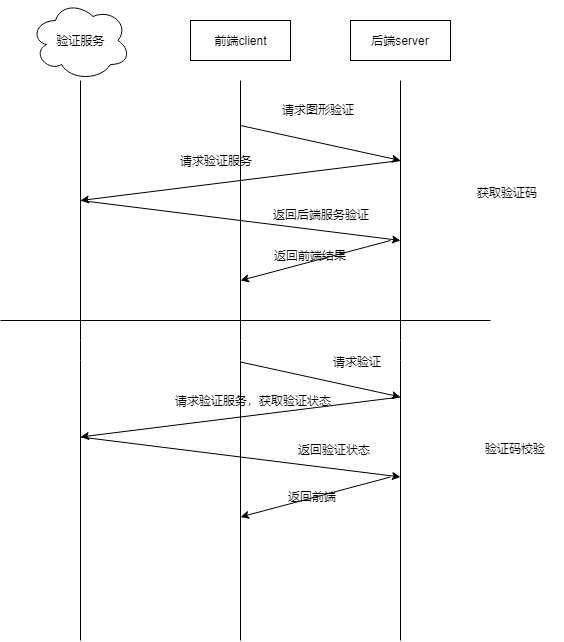

## 验证码图片生成校验工具 captcha
### 该项目包含了图片生成，验证码校验等简单实现思路
### 简单包括两个接口的简单示例
##### 1.getCaptchaBase64,生成图片
- 生成图形验证码，把图片key和答案存入redis
- 图片生成base64字符串传递给前端
##### 2.checkVerificationCode,图片验证码校验
- 根据code返回前端验证情况

### 调用关系为下图

